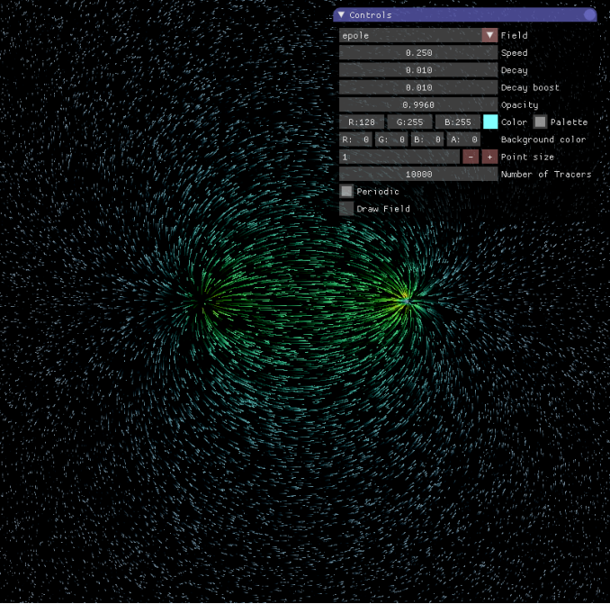
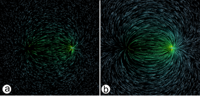
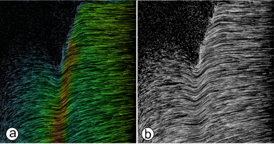
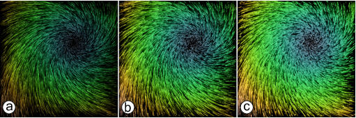
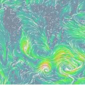

.. _app.py:                                                                     
             
Example application
===================

An example application :ref:`appcode` can be found in the
`examples <https://bitbucket.org/bvidmar/fieldanimation/src/master/examples>`_
directory.

The creation of a FieldAnimation image is straightforward: just instantiate
the :class:`fieldanimation.FieldAnimation`  class passing the vector field
array and call its draw method within the main rendering loop.
The visualization application shown above
depends on two OpenGL packages:

* `pyimgui <https://www.pygame.org/project/3212>`_ for setting interactively
  the visualization parameters and `GLFW <http://www.glfw.org/>`_
for rendering the OpenGL image created by FieldAnimation in a windowing
system.

The interactive GUI in this figure allows to modify the
visualization parameters that FieldAnimation embeds as instance attributes:

.. code-block:: python

    # Default values of the class attributes
    FieldAnimation.speedFactor = 0.25
    FieldAnimation.decay = 0.003
    FieldAnimation.decayBoost = 0.01
    FieldAnimation.fadeOpacity = 0.996
    FieldAnimation.color = (0.5 , 1.0 , 1.0)
    FieldAnimation.palette = True
    FieldAnimation.pointSize = 1.0
    FieldAnimation.tracersCount = 10000
    FieldAnimation.periodic = True
    FieldAnimation.drawField = False

Here is a detailed description of the controls that appear in the GUI:

* **Field**: select one of the available vector fields implemented.

* **Speed**: set the length of the field pathlines i.e. the speed of the
  particles: the higher the value the longer the particle trace length.

* **Decay**: set the life span of a particle.

* **Decay boost**: increase points density in low intensity field areas.

* **Opacity**: set opacity of the particles over the background image.

* **Color**: set color of the particles according to the the field strength
  trough a cubehelix based color map.

* **Palette**: set color of the particles to a constant value.

* **Point size**: set the size of the animated particles (in pixels).

* **Number of Tracers**: set the number of the moving particles.

* **Periodic**: if checked points that move outside the border of the
  rendering window will enter from the opposite one.

* **Draw Field**: Draw the field modulus as a background image.
  In this example application the field modulus is rendered trough
  a cubehelix color map.

