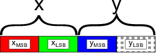

.. _code_design.py:

.. _PyOpenGL: http://pyopengl.sourceforge.net/                                  
                                                                                
.. _numpy:  http://www.numpy.org
             
Code design
===========
Nowadays the visualization of large numerical models is tricky due to the
high demand of graphical resources needed.
Furthermore scientist cannot take care of the efficiency of both the numerical
model and the visualization system.
Commercial applications or free ones, like `Visit <https://visit.llnl.gov/>`_
or `Paraview <https://www.paraview.org/>`_, are often used to visualize data
and understand their meaning. Unfortunately these applications provide
only standard visualizations tools, like quivers or streamplots,
and are slow or need datasets converted to specific formats.

Field Animation was written during the development of the simulation
package `PyGmod <https://www.google.com/url?sa=t&rct=j&q=&esrc=s&source=web&cd=13&ved=2ahUKEwjBj_eN-rfdAhWG-6QKHdYcCSwQFjAMegQIAhAC&url=http%3A%2F%2Fconference.scipy.org%2Fproceedings%2Fscipy2015%2Fpdfs%2Fnicola_creati.pdf&usg=AOvVaw0pp7loiHRIb7fr2gDBpo7b11>`_
for fast visualization of a geodynamic deformation field.
It implements a particles tracing visualization algorithm where
particles move according to the field streamlines giving an instantaneous
picture of its pattern and line flow.
FieldAnimation has been designed to process bidimensional arrays and
uses both PyOpenGL_ and numpy_ to take the most of the
available hardware .

The adoption of the OpenGL programming pipeline allows the usage of a large
number of particles (millions) and hence more detailed models.
Most of the computation is done by the GPU and it is instrumented by shaders
written in GLSL. The CPU merely takes care of the initialization of some
data structures and arrays.
The programmer must only focus on the dataset and forget about the interfaces.
The fieldanimation package consist of three modules:
:mod:`fieldanimation`, :mod:`fieldanimation.texture`
and :mod:`fieldanimation.shader`.
The last two are just support modules that handle openGL textures and shader
code loading, compiling and linking. :mod:`fieldanimation`
is the core module in charge of arranging all the data,
set the right parameters to the OpenGL context for rendering the scene and
defines the drawing workflow.
The animated image instance creation is straightforward:

.. code-block:: python                                                          
                                                                                
    animated_image = FieldAnimation(width, height, field)

* **width** and **height** are the vertical and horizontal pixels dimensions
  of the window
  
* **field** is an NxMx2 numpy_ array with the field
  components
  
All modules are kept as simple as possible to reduce dependencies but new
functionalities can be easily added subclassing
:class:`fieldanimation.FieldAnimation`.
The package can be integrated in any windowing system.

Particle tracing algorithm
--------------------------
FieldAnimation implements a simple OpenGL sequence of stages to draw on the
screen:
a vertex shader, a compute shader and a fragment shader. OpenGL connects
these shader programs with fixed functions glue. In the drawing process the
GPU executes the shaders piping their input and output along the pipeline
until pixel will come out at the end. The vertex shader stage handles
vertex processing such as space transformation, lighting and arranges work for
next rendering stages. The fragment shader manages the stage after the
rasterization of geometric primitive and defines the color of the pixel on the
screen.

Particle tracing starts with the generation of an array of random particle
positions on the screen. This array is stored in an OpenGL Texture object
encoding them as colors (RGBA values). A 100 pixels x 100 pixels texture
for example can store in this way 10.000 points positions. Particle
coordinates are encoded into two bytes, RG for x and BA for y

Each
texture pixel can therefore store 65536 distinct values for each coordinate.
The texture is passed to the GPU in a vertex shader and the the original
particles positions are retrieved from the RGBA texture using the “texture
fetched method“ in the vertex shader:

.. code-block:: GLSL

    #version 430
    layout (location = 0) in float index;

    uniform sampler2D tracers;
    uniform float tracersRes;

    // Model-View-Projection matrix
    uniform mat4 MVP;
    uniform float pointSize;

    out vec2 tracerPos;

    void main() {
        // Extracts RGBA value
        vec4 color = texture(tracers, vec2(
            fract(index / tracersRes),
            floor(index / tracersRes)
            / tracersRes));

        // Decodes current tracer position from the 
        // pixel's RGBA value (range from 0  to 1.0)
        tracerPos = vec2(
            color.r / 255.0 + color.b,
            color.g / 255.0 + color.a);

        gl_PointSize = pointSize;
        gl_Position = MVP * vec4(
        tracerPos.x, tracerPos.y, 0, 1);
    }
                                                                                

Decoding of particles
position from texture is implemented through an array with absolute indexes
of the particles, passed to the shaders.

